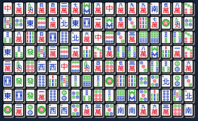
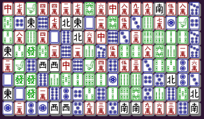

# 🀄 Two-Corner Tile Solitaire 🀄

A simple web adaptation of the tile puzzle game "Nikakudori" (or "Shisen-Sho").

**It can be played [here!](https://ktpease.github.io/2ctilesol)**

## The Game

The game itself is similar to [Mahjong solitaire](https://en.wikipedia.org/wiki/Mahjong_solitaire), in which a board full of Mahjong tiles is cleared by matching pairs of exposed tiles.

The main differences are that tiles are no longer stacked on top of each-other and that all tiles are now considered exposed, but can only be matched as a pair if they follow the rule of "nikakudori" (or "two-angle take"):

- When matching pairs, a path of 1-3 orthogonal line segments must be imagined between them so that no line touches any other tile. This, by definition, forms less than three right angles/corners.

More information on the game itself can be found at [Wikipedia](https://en.wikipedia.org/wiki/Shisen-Sho).

## The Tech

This project was developed with [React](https://reactjs.org/), uses the [Vite](https://vitejs.dev/) toolchain, and is hosted on [GitHub Pages](https://pages.github.com/).

Some technical features of the game include:

* Randomized board generation, both with a purely-random shuffle (used for the game's "Hard Mode") and a unique shuffle that does not generate unwinnable boards. Supports seeding.

* Custom algorithm to detect valid matches.

* Reponsive game window, adjusting automatically to window size, orientation, and pointer style. When played on a portrait screen (such as a phone held upright), the board layout is rotated to make the most use of space.

* Limited [PWA](https://en.wikipedia.org/wiki/Progressive_web_application) support.

This project does not use any custom images or fonts for displaying tiles, instead utilizing the [Mahjong Tiles Unicode block](https://en.wikipedia.org/wiki/Mahjong_Tiles_(Unicode_block)) with standard fonts, adjusted with CSS to better resemble tiles. Supports non-standard emoji variants (namely Microsoft's Segoe UI Emoji).

The game will not display correctly in earlier browsers and may not display correctly with certain fonts.

---

  
A game board rendered using non-standard emojis (Segoe UI Emoji).

  
The same board rendered using Unicode glyphs.

---